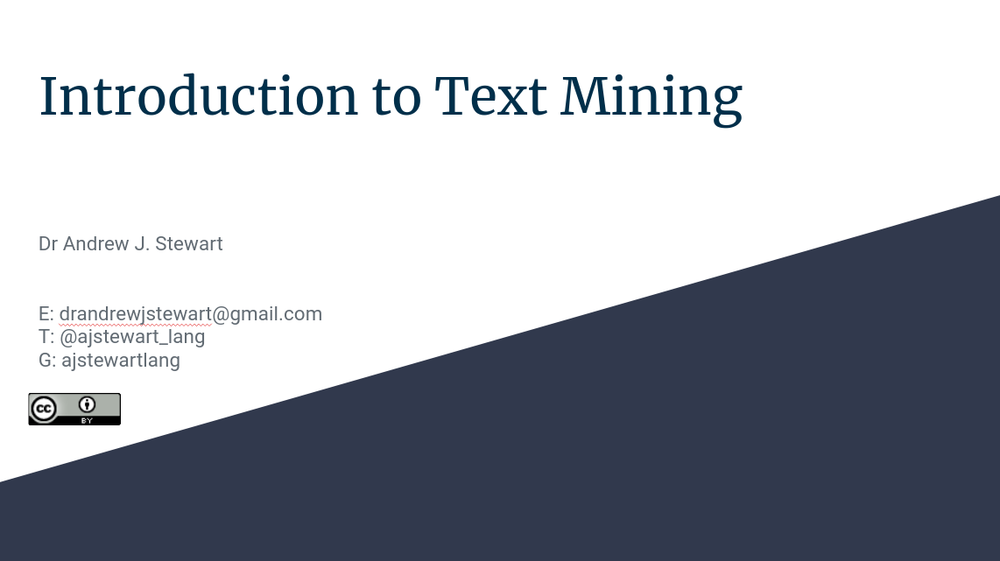

```{r setup, include=FALSE}
knitr::opts_chunk$set(echo = TRUE)
```

# Overview 

In any set of texts (such as books, interview transcripts etc.) it’s often useful to be able to quantify key aspects of the constituent parts (e.g., words, phrases). For example, some types of language may be more common in one interview transcript vs. another, and it can be useful to visualise the content of a particular text to compare it with others. In this session we are going to examine how to the `{tidytext}` package in R to engage in some simple text analysis. We will examine how to count the occurrences of words in a text, engage in a basic sentiment analysis to examine what kinds of sentiments might be most common in a text, as well as using measures such as term frequency-inverse document frequency as a way to understanding what words (or phrases) are most uniquely associated with a text (compared to another set of texts). The material I'm going to cover is very much based on the fantastic "Text Mining Wirh R" book by Julia Silge and David Robinson. Scroll down to find a link to the book - or better still, buy it!


&nbsp;&nbsp;

<center>

<iframe width="560" height="315" src="https://youtube.com/embed/" frameborder="0" allowfullscreen></iframe>

</center>
&nbsp;&nbsp;

## Slides

You can download the slides in .odp format by clicking [here](../slides/introduction_to_text_mining.odp) and in .pdf format by clicking on the image below. 

&nbsp;&nbsp;

<center>

[{width=75%}](../slides/introduction_to_text_mining.pdf)

</center>

&nbsp;&nbsp;

# The Text Mining with R Book

This is a great book for introducing you to using R for text mining. You can click on the image below to be taken to an electronic version of the book. Both [Julia Silge](https://twitter.com/juliasilge) and [David Robinson](https://twitter.com/drob) are very active on Twitter and well worth following for all things R related.

&nbsp;&nbsp;

<center>

[{width=30%}](https://www.tidytextmining.com/) 

</center>

&nbsp;&nbsp;

# Your challenge

Have a look at the [Project Gutenberg library](https://www.gutenberg.org/) where you can access over 60,000 free eBooks. You could download just the one book of your choice, a set of books by the same author, or a set of books by different authors. Using the material in the slides from this session, conduct text analysis on your download. Maybe start with the most common words in a book or set of books. If you've downloaded a set of books by the same author you could work out the tf-idf measure for each of the books. Or if you downloaded books by different authors, maybe you could examine the tf-idf measure for each of the authors. Perhaps different authors have different words or phrases that the favour over others...

## Improve this Workshop

If you spot any issues/errors in this workshop, you can raise an issue or create a pull request for [this repo](https://github.com/ajstewartlang/27_text_mining). 